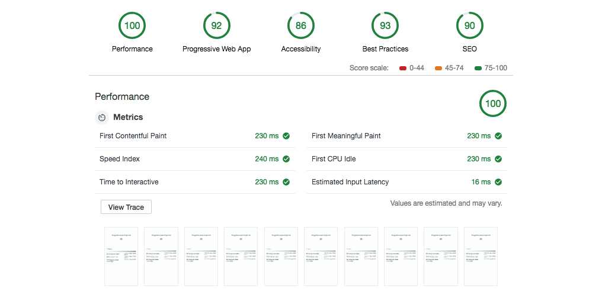

# blog.morera.computer

A personal blog on Software Engineering, JavaScript, Unix and macOS-related topics.

Primary technologies used are React, Gatsby.js, styled-components and GraphQL.

Current Lighthouse auditing report:

