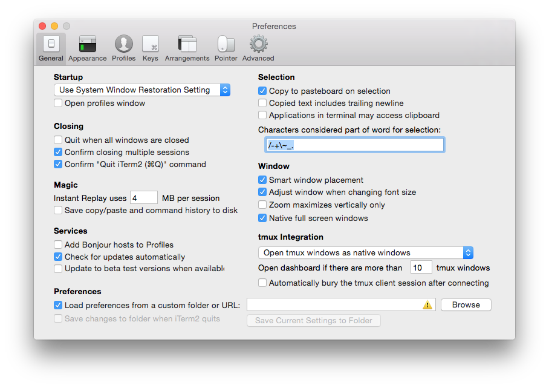

If you have multiple computers or are setting up a fresh install, you'll likely want to keep your development environment in sync. Even when working with a single computer, it's a good idea to create backups of your terminal settings, in case you ever want to revert back to or reference a previous version. Below is a guide to exporting and importing Profiles, Preferences and Color Schemes for the [iTerm2](https://www.iterm2.com/) terminal emulator.

## Method 1: Export *all* Profiles and Preferences

This method will exhaustively save *all* global preferences as well as individual Profile settings to a `com.googlecode.iterm2.plist` file. This is the ideal method if you'd like to import/export settings beyond just a profile's color scheme.

### Export

1. Open up the Preferences window via the Main Menu or `⌘,`
2. On the **General** tab, enable the **Load preferences from a custom folder or URL** option
3. Browse for a folder you'd like to save the preference file to, via the **Browse** button. I recommend saving this to a new folder specific for this purpose — ideally in a Git repo to have version control over time
4. Click the **Save Current Settings to Folder** button

### Import

1. Open up the Preferences tab
2. Assuming you are importing the file from a different computer or fresh install of iTerm2, make sure the **Load preferences from a custom folder or URL** option is enabled
3. Browse for the folder you have the `.plist` file saved in and open it
4. All preferences and Profiles should now be imported into iTerm2. You may need to re-start the application for the changes to take effect.

## Method 2: Export Color Schemes Only

If you only want to export color schemes, you can do so for each profile individually.

### Export

1. Open up the Preferences window
2. Select the **Profiles** tab, then a profile you'd like to export the color scheme for
3. Select the **Colors** inner tab
4. In the bottom right will be a **Color Presets...** dropdown. Scroll all the way to the bottom, until you find **Export...**
5. Click on **Export...**, then select a directory where you'd like to save the `.itermcolors` file to

### Import

1. Follow steps 1 - 4 above. Now, instead of selecting **Export...** from the **Color Presets...** dropdown, select **Import...** from the same dropdown instead
2. Select the saved `.itermcolors` file you want to import from the **Open** window pop up

## References

[How to export iTerm2 Profiles](https://stackoverflow.com/questions/22943676/how-to-export-iterm2-profiles/23356086#23356086)

[My dotfiles](https://github.com/rom-dos/dotfiles)

